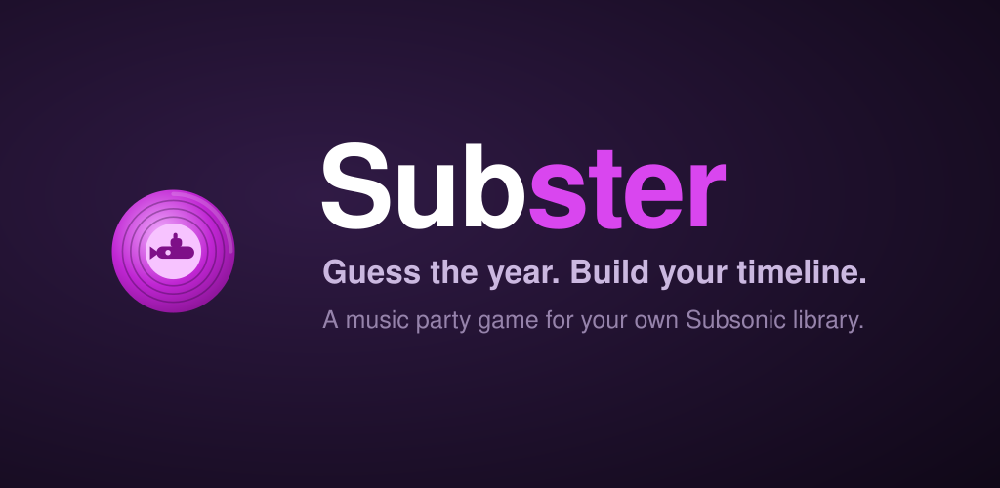
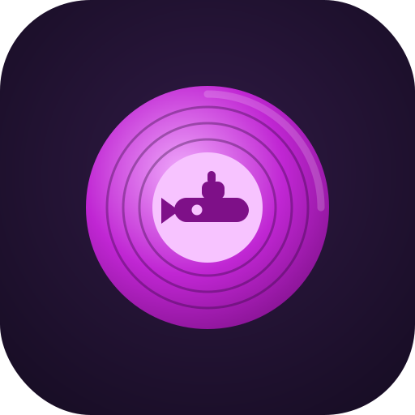
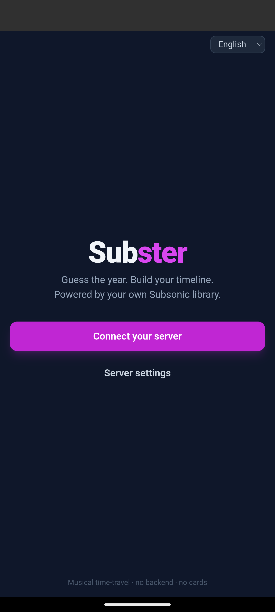
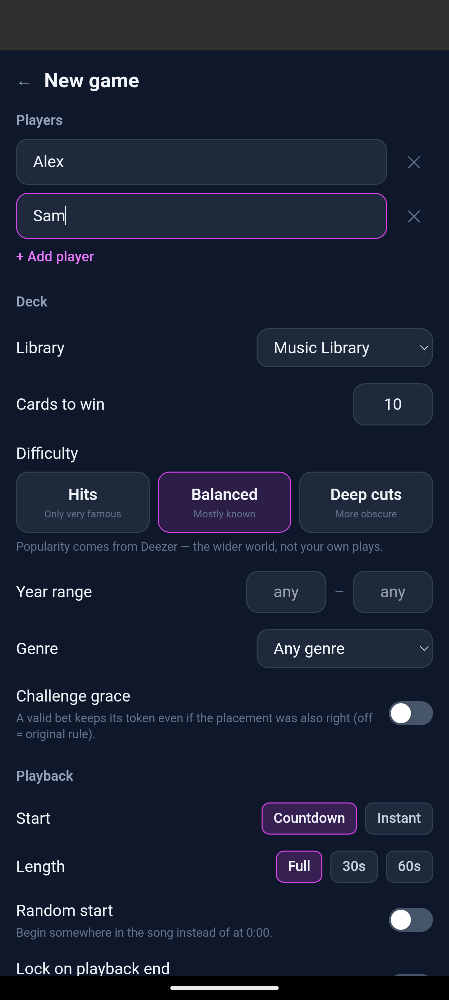
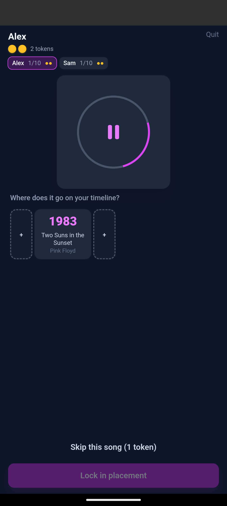
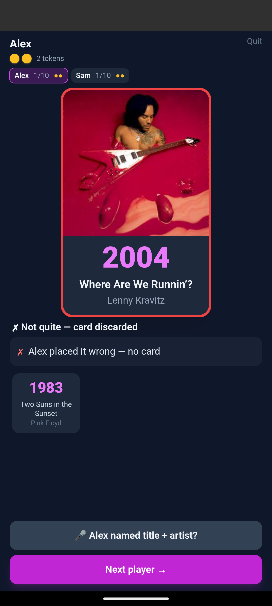

<p align="center">
  
</p>

#  Subster

A backend-free, smartphone-only **music timeline party game** that plays **your own music** from a
[Subsonic](https://www.subsonic.org/)-compatible server (Navidrome, Airsonic, Gonic, …). A random
song plays blind; you place it on your timeline by guessing whether it's older or newer than the
songs already there. Guess right, keep the card. First to 10 cards wins.

No physical cards, no accounts, **no backend** — just your phone and your own music library.

## Screenshots

<p align="center">
  
  
  
  
</p>

## Status

**A fully playable pass-and-play game on one phone** (milestones 1–3 plus most of the ruleset):

- ✅ Subsonic connection (token auth) + connection test, with an optional **local (LAN) address**
  that is preferred automatically whenever it answers (the home screen shows "· LAN" when active)
- ✅ **Deck sources** — a music folder ("All libraries" included, e.g. skip your Audiobooks library)
  or **any Subsonic playlist**: hand-picked lists play as-is (shuffled, file years, no ranking),
  though the full pipeline can be re-enabled on top
- ✅ **Online-metadata toggle** — switch off and **only your own server is contacted**: no
  Deezer/MusicBrainz/Wikidata at all (guaranteed by tests), file years as-is, and the bundled
  curated canon still works since it's offline data
- ✅ **Original release year** via [MusicBrainz](https://musicbrainz.org/): a song's file year is often
  a remaster/compilation year, so we look the recording up (by its MusicBrainz ID → ISRC → Deezer ISRC →
  fuzzy text, in that order) and take the earliest recording date. (e.g. "The Boxer" tagged 1991 on a
  Greatest-Hits album → corrected to 1969.) For songs MusicBrainz can only date to a late reissue —
  typically old tracks — we fall back to [Wikidata](https://www.wikidata.org/)'s published year (e.g. a
  1936 chanson MusicBrainz dates 1992). Falls back to the file's year if nothing resolves.
- ✅ **Deck builder**: a **75/25 known-vs-rest mix** where "known" is chosen by *oversampling* — a large
  pool is ranked by [Deezer](https://www.deezer.com/)'s track `rank` and the genuinely top-ranked songs
  become the known pool (the obscure long tail is discarded), so the deck actually feels recognizable.
  Live/unplugged versions are filtered out; a √-weighted decade spread is applied per chunk.
- ✅ **Curated canon**: a bundled, offline list of widely-famous songs (Billboard Year-End Hot 100
  1959–2024, German/Austrian/Swiss #1 singles, "greatest songs" critic lists — factual chart data,
  region-grouped in `src/metadata/curated.json`). Canon songs found in your library are boosted into
  the deck regardless of Deezer play counts, which under-rate older or regional hits.
- ✅ **Incremental deck**: the pool is ranked cheaply, then original years are resolved chunk by chunk —
  the first chunk lets play start; the rest fill in the background (Deezer/MusicBrainz calls are cached).
- ✅ Core game: blind playback, timeline placement, reveal, win target (configurable)
- ✅ **Keep your discoveries**: the game keeps surfacing pearls you forgot you had — on the reveal,
  heart the song (server favorites, in sync with its starred state) or add it to any of your
  playlists straight from the card (duplicates are detected; tap again to remove)
- ✅ **Tokens & rules**: skip (1 token), **challenges** — other players bet a token on a different gap
  and steal the card if they're right (optional grace rule), **naming bonus** (+1 token for naming
  title + artist), equal-year placements count as correct
- ✅ **Playback options**: countdown or instant start, full song / 30s / 60s clips, random start
  position, lock-on-end mode with a big flashing placement countdown
- ✅ **Difficulty presets** (Hits / Balanced / Deep cuts) + year-range and genre filters
- ✅ Installable as a **PWA** (offline app shell) and as an **Android APK**; on Android the song keeps
  playing with the screen off via a native media session (lock-screen controls)
- ✅ English + German UI
- ⏳ Later: PRO/EXPERT/Teamwork modes, multi-device real-time play (Trystero P2P)

## Develop

```bash
npm install
npm run dev        # http://localhost:5173
npm test           # unit tests (game engine, deck builder, metadata, Subsonic client)
npm run typecheck
npm run build      # production build → dist/
```

## How it connects to Subsonic

On first launch you enter your server URL, username, and password. The password is **never stored**
— only a salted token (`token = md5(password + salt)`) is kept in this device's `localStorage`, and
only on the device that acts as host/DJ.

Prefer an **https** server URL: with plain `http`, the token (which grants API access) and your
audio travel unencrypted through your network. The app shows a warning when you enter an `http://`
URL but still allows it, since LAN-only setups are common.

Optionally add a **local address** (e.g. `http://192.168.1.20:4533`): on each start the app pings
it briefly and uses it when reachable — fast and direct at home, automatic fallback to the server
URL when away. The home screen appends "· LAN" to the server name while the local address is in use.

- **Audio** streams via `stream.view` into an `<audio>` element, and **cover art** via
  `getCoverArt.view` into ``. Neither is affected by CORS.
- **The JSON API calls** (`ping`, `getRandomSongs`, `getGenres`, …) are `fetch` requests, which
  browsers gate with CORS. See below.

### CORS (browser only)

CORS is a browser rule about *reading* cross-origin responses — nothing is ever written to your
server. It only affects the JSON API calls. Two ways to satisfy it:

1. **Same-origin (simplest):** serve Subster's static `dist/` behind the same reverse proxy as your
   Subsonic server (e.g. both under `https://music.example.com`). Then there's no cross-origin
   request and no CORS at all.
2. **Enable CORS** on your server / reverse proxy so it returns `Access-Control-Allow-Origin`.

The **Android app avoids CORS completely** — it uses Capacitor's native HTTP layer, so API calls
don't go through the browser's CORS gate. Any reachable Subsonic server works without extra config.
This also matters for **Deezer** (popularity), which sends no CORS headers: popularity works in the
APK but not in a plain desktop-browser build (where songs just fall back to "unknown"). MusicBrainz
and Wikidata send `Access-Control-Allow-Origin: *`, so original-year resolution works everywhere.

## Privacy

Subster has no backend, no accounts, and no analytics. To build the deck it sends the **artist,
title, and ISRC** of candidate songs from your library to three public APIs:

- **Deezer** — to rank how recognizable a track is (its public play-count rank),
- **MusicBrainz** — to find a song's original release year, and
- **Wikidata** — a fallback published year for songs MusicBrainz can only date to a late reissue.

Nothing else leaves your device: no user identity, no server address, no listening history. All
APIs are contacted over https, and every lookup is cached locally so repeat games re-send nothing.
If that tradeoff isn't for you, switch **Online metadata off** in the game setup: then Subster
contacts **only your own server** — file-tagged years are used as-is and the bundled curated canon
provides the recognizability signal. (Playlists default to this mode.)

### First run is slower

Resolving a song hits Deezer (popularity) and MusicBrainz (original year, rate-limited to ~1 req/s),
with an occasional Wikidata lookup for songs MusicBrainz can't cleanly date. The deck builds
incrementally — a small first batch lets the game start quickly, then it tops up in the background.
All lookups are cached in `localStorage`, so later games with the same library are fast.

## Android (install on a device via adb)

Subster wraps the web build in a [Capacitor](https://capacitorjs.com/) WebView so it installs as a
normal APK (app id `app.subster`).

Requirements: Android SDK (platform 34/35) and a **full JDK 17** — Gradle/AGP 8.2 need JDK 17
specifically (not 21), and it must include `jlink`/`jmods` (some distro JRE packages don't;
[Temurin](https://adoptium.net/) 17 works).

```bash
export ANDROID_HOME=~/Android/Sdk
export JAVA_HOME=/path/to/jdk-17     # full JDK 17 with jlink
npm run build
npx cap sync android
cd android && ./gradlew assembleDebug
adb install -r app/build/outputs/apk/debug/app-debug.apk
```

Debug builds install as **`app.subster.dev`** ("Subster Dev", teal icon) alongside a release
install, so a dev build never conflicts with the app you update via releases/Obtainium.

## Releases

Pushing a git tag `vX.Y.Z` triggers the [release workflow](.github/workflows/release.yml): it runs
the tests, builds the web bundle and a **signed APK** (version name/code derived from the tag), and
attaches both to a GitHub Release.

One-time setup — create a release keystore and add it to the repo's Actions secrets:

```bash
keytool -genkeypair -v -keystore release.keystore -alias subster \
  -keyalg RSA -keysize 4096 -validity 10000
base64 -w0 release.keystore   # → secret ANDROID_KEYSTORE_BASE64
# also set: ANDROID_KEYSTORE_PASSWORD, ANDROID_KEY_ALIAS, ANDROID_KEY_PASSWORD
```

Keep `release.keystore` somewhere safe and **out of the repo** (`*.keystore` is gitignored) — all
future APKs must be signed with it for in-place updates to work.

## License

[MIT](LICENSE)
