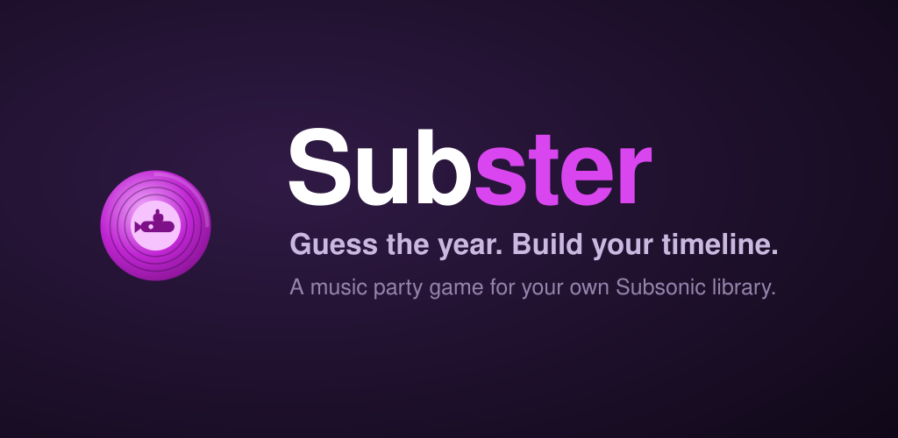
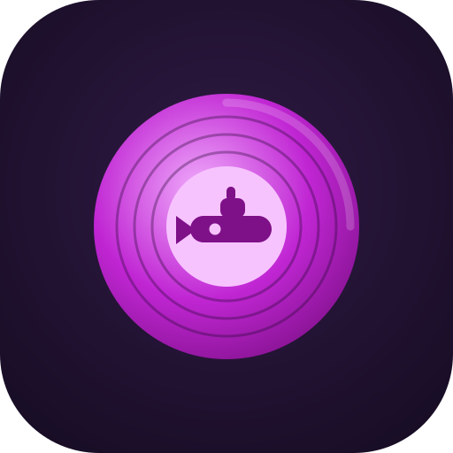
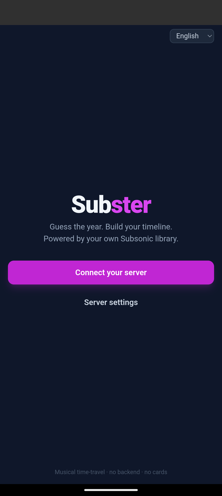
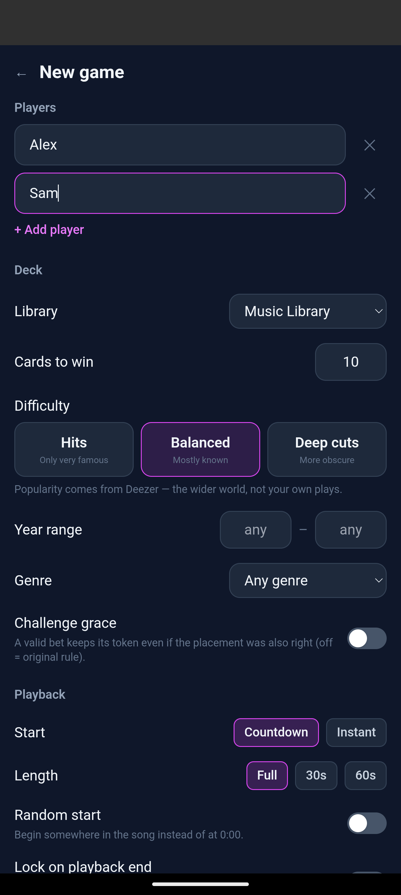
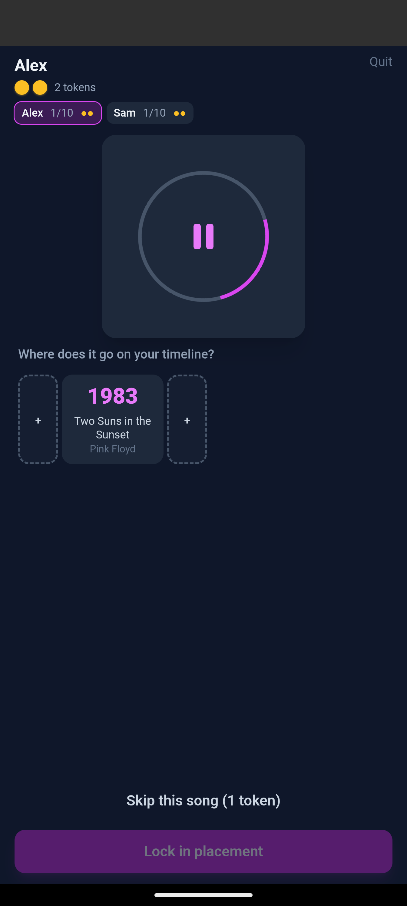
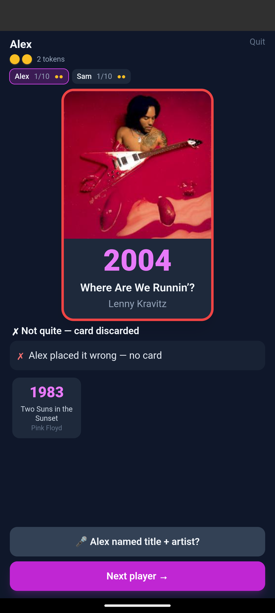

<p align="center">
  
</p>

#  Subster

A backend-free, smartphone-only **music timeline party game** that plays **your own music** from a
[Subsonic](https://www.subsonic.org/)-compatible server (Navidrome, Airsonic, Gonic, …). A random
song plays blind; you place it on your timeline by guessing whether it's older or newer than the
songs already there. Guess right, keep the card. First to 10 cards wins.

No physical cards, no accounts, **no backend** — just your phone and your own music library.

<p align="center">
  <a href="https://f-droid.org/en/packages/app.subster/">
    
  </a>
</p>

## Screenshots

<p align="center">
  
  
  
  
</p>

## Status

**A fully playable pass-and-play game on one phone** (milestones 1–3 plus most of the ruleset):

- ✅ Subsonic connection + connection test, with an optional **local (LAN) address** that is
  preferred automatically whenever it answers (the home screen shows "· LAN" when active).
  Token auth by default, with an automatic fallback to legacy password auth for servers that
  refuse it
- ✅ **Several servers**: save as many as you like and switch between them; each remembers its own
  libraries, playlist and genre
- ✅ **Deck sources** — any combination of your libraries (e.g. Music + Soundtracks, skipping
  Audiobooks), each weighted by the square root of its size, so a small library gets a fair share
  without flooding the deck, or **any Subsonic playlist**: hand-picked lists play as-is (shuffled,
  file years, no ranking), though the full pipeline can be re-enabled on top. No artist fills more
  than about a tenth of a deck unless there is nothing else, and an artist's cards rotate through
  the players
- ✅ **Online-metadata modes** — *Full*, *No Deezer* (keeps MusicBrainz/Wikidata years, drops the
  one proprietary service), or *Offline*, where **only your own server is contacted**: no
  Deezer/MusicBrainz/Wikidata at all (guaranteed by tests), file years as-is, and the bundled
  curated canon still works since it's offline data
- ✅ **Original release year** via [MusicBrainz](https://musicbrainz.org/): a song's file year is often
  a remaster/compilation year, so we identify the recording (by its MusicBrainz ID → ISRC → **the
  album's tracklist** → Deezer ISRC → fuzzy text, in that order) and take its **first official
  release**. Bootlegs, promos and demos don't count — a 1990 concert bootleg is not when the Black
  Album came out — while a single that preceded its album does. (e.g. "The Boxer" tagged 1991 on a
  Greatest-Hits album → corrected to 1969.) The album step matters most for servers that never expose
  MusicBrainz IDs, such as Nextcloud Music: it is what tells a *Mothership* rip of "No Quarter" apart
  from the Page & Plant one. For songs MusicBrainz can only date to a late reissue — typically old
  tracks — we fall back to [Wikidata](https://www.wikidata.org/)'s published year (e.g. a 1936 chanson
  MusicBrainz dates 1992). If nothing resolves, the song is **left out of the deck** rather than dealt
  with its file year: a wrong year makes a placement objectively wrong, while a missing song only makes
  the deck shorter. *Offline* mode is the exception and uses the file year by design. It isn't
  perfect: see [How reliable are the years?](#how-reliable-are-the-years)
- ✅ **Deck builder**: a **75/25 known-vs-rest mix** where "known" is chosen by *oversampling* — a large
  pool is ranked by [Deezer](https://www.deezer.com/)'s track `rank` and the genuinely top-ranked songs
  become the known pool (the obscure long tail is discarded), so the deck actually feels recognizable.
  Live/unplugged versions are filtered out; a √-weighted decade spread is applied per chunk.
- ✅ **Curated canon**: a bundled, offline list of widely-famous songs (Billboard Year-End Hot 100
  1959–2024, German/Austrian/Swiss #1 singles, "greatest songs" critic lists — factual chart data,
  region-grouped in `src/metadata/curated.json`). Canon songs found in your library are boosted into
  the deck regardless of Deezer play counts, which under-rate older or regional hits. A one-time
  scan in the server settings finds all of them on your server up front (see
  [Find the famous songs on your server](#find-the-famous-songs-on-your-server)). Which lists count
  is a choice in the game setup, e.g. only the international one and your own country's
- ✅ **Incremental deck**: the pool is ranked cheaply, then original years are resolved chunk by chunk —
  the first chunk lets play start; the rest fill in the background (Deezer/MusicBrainz calls are cached).
- ✅ Core game: blind playback, timeline placement, reveal, win target (configurable)
- ✅ **Keep your discoveries**: the game keeps surfacing pearls you forgot you had — on the reveal,
  heart the song (server favorites, in sync with its starred state) or add it to any of your
  playlists straight from the card (duplicates are detected; tap again to remove)
- ✅ **Exclusions**: keep artists, albums, songs or playlists out of the deck, picked in the game
  setup or straight from the reveal (e.g. songs that upset someone at the table). The list stays on
  the device, is never written to the server, and matches by name, so it works on every server
- ✅ **Tokens & rules**: skip (1 token), **challenges** — other players bet a token on a different gap
  and steal the card if they're right (optional grace rule), **naming bonus** (+1 token for naming
  title + artist), equal-year placements count as correct
- ✅ **Playback options**: countdown or instant start, full song / 30s / 60s clips, random start
  position, lock-on-end mode with a big flashing placement countdown
- ✅ **Difficulty presets** (Hits / Balanced / Deep cuts) + year-range and genre filters
- ✅ Installable as a **PWA** (offline app shell) and as an **Android APK**; on Android the song keeps
  playing with the screen off via a native media session (lock-screen controls)
- ✅ English, German and Dutch UI
- ⏳ Later: PRO/EXPERT/Teamwork modes, multi-device real-time play (Trystero P2P)

## Develop

```bash
npm install
npm run dev        # http://localhost:5173
npm test           # unit tests (game engine, deck builder, metadata, Subsonic client)
npm run typecheck
npm run build      # production build → dist/
```

## Translations

The UI is available in English, German and Dutch. Corrections and new languages are very welcome
as pull requests, and no coding experience is needed beyond editing a text file.

All UI text lives in [`src/i18n/`](src/i18n), one file per language. [`en.ts`](src/i18n/en.ts) is
the source of truth: every other language must contain exactly the same keys, and the build fails
if one is missing.

**Fix an existing translation:** edit the string in that language's file (e.g.
[`de.ts`](src/i18n/de.ts)) and open a PR.

**Add a language** (French as the example):

1. Copy `src/i18n/de.ts` to `src/i18n/fr.ts`, rename the export to `fr`, and translate the values.
   Leave the keys (left of the colon) as they are. Some values are small functions, such as
   `` playerN: (n: number) => `Player ${n}` `` — translate only the text inside the backticks and
   keep `${…}` placeholders intact.
2. Register it in [`src/i18n/index.ts`](src/i18n/index.ts): add `fr` to `LOCALES` and
   `{ code: 'fr', label: 'Français' }` to `LANGUAGES`. The code is the two-letter language code;
   the app picks it automatically on devices set to that language.
3. Run `npm run typecheck` to confirm nothing is missing. If you can't run it, open the PR anyway
   and we'll check it.
4. Optional: the store listing lives in `fastlane/metadata/android/<locale>/`
   (`title.txt`, `short_description.txt`, `full_description.txt`).

**Not comfortable with a PR?** Open an issue naming the language. We can draft a machine
translation as a PR for you to review: a native speaker reading over a draft is quicker than
translating from scratch, and catches what a machine gets wrong.

## Adding a country's hit list

Besides Deezer popularity, Subster knows which songs are famous from a bundled list in
[`src/metadata/curated.json`](src/metadata/curated.json). Songs on it that are in your library are
boosted into the deck, and in the offline modes the list is the only popularity signal there is. It
holds an international core (`intl`: Billboard Year-End Hot 100 and songs on several "greatest
songs" lists) plus the **#1 singles of each country** it covers, currently Germany (`de`), Austria
(`at`) and Switzerland (`ch`). If hits from your country are missing, a PR adding it is welcome.

Players pick which lists count under **Hit lists** in the game setup (all by default). A new
country shows up there by itself, named in the player's language from its code.

**The format** is one object per country, keyed by its lowercase
[ISO 3166-1 alpha-2](https://en.wikipedia.org/wiki/ISO_3166-1_alpha-2) code, mapping each artist
to their titles:

```json
{
  "intl": { "…": ["…"] },
  "nl": {
    "Some Artist": ["Their First #1", "Their Second #1"],
    "Another Artist feat. Guest": ["A Duet"]
  }
}
```

- Write artist and title as the chart lists them. Matching against your library ignores case,
  punctuation, a leading "The", "feat." credits and suffixes such as "(Remastered)", so there is
  no need to normalize them yourself.
- Each title appears once per artist. A song that is also in another country's list is fine.
- Watch for scraping debris: footnote markers (`[3]`) and songwriter credits that end up glued to
  the title (`"Easy on MeAdele Atkins, Greg Kurstin"`). A title like that never matches.

**Sources** must be plain chart facts, e.g. Wikipedia's "List of number-one singles in …" pages
or the official chart archive for that country. Which song was #1 when is a fact, not anyone's
creative work. Don't copy a curated "best of" list from a single publication, since that
selection is somebody's own work.

**Check it:** `npm test` confirms the file still parses and the existing matches still work.

**Not comfortable with a PR?** Open an issue naming the country and, if you know one, a good
source. We can put the list together as a PR for you to check against what you know of your
country's charts.

**Genre lists** fit the same format: a list doesn't have to be a country, it is just a key with
artists and titles under it. A "metal" or "schlager" list would mostly help together with the
genre filter, where Deezer ranks the famous songs of a niche genre too low to count as hits. The
same source rule applies, so year-end genre charts (e.g. Billboard's Hot Country Songs or Hot
Rap Songs, Germany's official Schlager chart) work, while editorial "greatest metal songs" lists
don't. Unlike a country, a genre can't be named from its code, so the first genre list will also
need a translated label in the app. If you have a list with a clean chart source, open an issue
or a PR and we'll add that part.

## How it connects to Subsonic

On first launch you enter your server URL, username, and password. Normally the password is **not
stored** — only a salted token (`token = md5(password + salt)`) is kept in this device's
`localStorage`, and only on the device that acts as host/DJ.

Some servers refuse token auth and accept only **legacy authentication**, where the password is sent
as-is; Nextcloud Music is one. The connection test detects that (Subsonic error 41) and falls back
automatically, which means the password itself has to be stored for those servers. The app says so
when it happens and suggests using an app password rather than your account password.

Prefer an **https** server URL: with plain `http`, the credentials (which grant API access) and your
audio travel unencrypted through your network. The app shows a warning when you enter an `http://`
URL but still allows it, since LAN-only setups are common.

Optionally add a **local address** (e.g. `http://192.168.1.20:4533`): on each start the app pings
it briefly and uses it when reachable — fast and direct at home, automatic fallback to the server
URL when away. Leaving the WiFi mid-game switches over after a short stall; coming back is noticed
when the app returns to the foreground or a game ends. The home screen appends "· LAN" to the
server name while the local address is in use.

- **Audio** streams via `stream.view` into an `<audio>` element, and **cover art** via
  `getCoverArt.view` into ``. Neither is affected by CORS.
- **The JSON API calls** (`ping`, `getRandomSongs`, `getGenres`, …) are `fetch` requests, which
  browsers gate with CORS. See below.

### CORS (browser only)

CORS is a browser rule about *reading* cross-origin responses — nothing is ever written to your
server. It only affects the JSON API calls. Two ways to satisfy it:

1. **Same-origin (simplest):** serve Subster's static `dist/` behind the same reverse proxy as your
   Subsonic server (e.g. both under `https://music.example.com`). Then there's no cross-origin
   request and no CORS at all.
2. **Enable CORS** on your server / reverse proxy so it returns `Access-Control-Allow-Origin`.

The **Android app avoids CORS completely** — it uses Capacitor's native HTTP layer, so API calls
don't go through the browser's CORS gate. Any reachable Subsonic server works without extra config.
This also matters for **Deezer** (popularity), which sends no CORS headers: popularity works in the
APK but not in a plain desktop-browser build (where songs just fall back to "unknown"). MusicBrainz
and Wikidata send `Access-Control-Allow-Origin: *`, so original-year resolution works everywhere.

## Privacy

Subster has no backend, no accounts, and no analytics. To build the deck it sends the **artist,
title, and ISRC** of candidate songs from your library to three public APIs:

- **Deezer** — to rank how recognizable a track is (its public play-count rank),
- **MusicBrainz** — to find a song's original release year, and
- **Wikidata** — a fallback published year for songs MusicBrainz can only date to a late reissue.

Nothing else leaves your device: no user identity, no server address, no listening history. All
APIs are contacted over https, and every lookup is cached locally so repeat games re-send nothing.
If that tradeoff isn't for you, **Online metadata** in the game setup has three settings:

- **Full** (default) — all three APIs, as described above.
- **No Deezer** — skips the only proprietary service of the three. Years are still corrected via
  MusicBrainz and Wikidata (both open-data projects), and the bundled curated canon supplies the
  recognizability signal instead of Deezer's rank. A good middle ground: a wrong year makes a
  placement objectively wrong, whereas missing ranking only makes the deck less well-curated.
- **Offline** — contacts **only your own server**; file-tagged years are used as-is and the curated
  canon again provides recognizability. (Playlists default to this mode.)

### First run is slower

Resolving a song hits Deezer (popularity) and MusicBrainz (original year, rate-limited to ~1 req/s),
with an occasional Wikidata lookup for songs MusicBrainz can't cleanly date. The deck builds
incrementally — a small first batch lets the game start quickly, then it tops up in the background.
All lookups are cached in `localStorage`, so later games with the same library are fast.

### Find the famous songs on your server

Every deck mixes in songs from the bundled famous-songs list that are in your library. A game only
searches as many of them as its deck needs, so without help the app learns your library's famous
songs a few dozen per game, and the first games repeat more.

**Server settings → Find famous songs on this server** searches the whole list once, and is
recommended right after adding a server (the home screen shows a tip until it has run). It only
searches songs by artists in your library and only contacts your own server. It ends with a summary
such as *"562 of the 8064 bundled famous songs found (1018 by artists in your library)"*. On a home
network it takes seconds; on mobile data it can take a few minutes, and it keeps running if you
leave the screen. Run it again after adding music: each run searches everything afresh, which is
also how songs added since are noticed.

## How reliable are the years?

Most cards get the right year, but not all of them. The year can only be as good as the data behind
it, and it is worked out automatically from incomplete public data. These are the known weak spots:

- **MusicBrainz is only as complete as its volunteers made it.** A recording can be missing, have
  no dates, or have a wrong one. Wikidata only fills in for songs MusicBrainz can't date at all.
- **Compilation rips depend on a search.** If the file's recording appears only on best-ofs (common
  for songs that first came out as singles), the year comes from a text search for the artist and
  title. That search finds every version of the song, live takes and remixes included, and has to
  pick the earliest real release among them.
- **"The year" is not always clear-cut.** A single and its album, or the UK and US releases, can
  be a year apart. Subster takes the first official release anywhere, which is not always the
  year a song is remembered for.
- **The earliest match wins.** Subster takes the earliest release among the matches, so an older,
  different song with the same title by the same artist can make a card too old.
- **Failed requests.** MusicBrainz rejects requests when it is busy. Subster retries, but if a
  lookup still fails, a song can be left out or keep a later year. Failed lookups aren't stored,
  so the next deck build tries again.
- **Answers are stored on the device.** Once looked up, a year is kept until you clear it, even if
  MusicBrainz is corrected in the meantime. **Server settings → Clear metadata caches** makes the
  next deck build look everything up again.
- **Offline mode uses your tags.** In *Offline* mode (the default for playlists), the year is the
  file's own year tag, unchanged. That is often the year of the remaster or compilation, not of
  the song.

### Report a wrong year

If a card shows a wrong year, tap the **flag** on the revealed card. It copies everything we need
(the song as your server sends it, how Subster found the year, the app and server versions), and
can also open a [new issue](https://github.com/pLum0/subster/issues/new) with it already filled
in. You don't have to do that mid-game: the text stays on the clipboard to report later.

Please add the year you expected, ideally with a source. The **full tag list of the file** helps
too, but is optional and can be added later, e.g. from a computer: the app only sees what your
server sends, while the file's MusicBrainz IDs, ISRC and album say exactly which recording it is.
Run `ffprobe -hide_banner "song.mp3"` or `exiftool "song.mp3"`, or copy everything your tag editor
shows (Mp3tag, foobar2000, MusicBrainz Picard).

If the mistake is in MusicBrainz itself, correcting it [there](https://musicbrainz.org/) fixes it
for everyone who uses MusicBrainz. After that, clear the metadata caches to see the new year.

## Android (install on a device via adb)

Subster wraps the web build in a [Capacitor](https://capacitorjs.com/) WebView so it installs as a
normal APK (app id `app.subster`).

Requirements: Android SDK (platform 34/35) and a **full JDK 17** — Gradle/AGP 8.2 need JDK 17
specifically (not 21), and it must include `jlink`/`jmods` (some distro JRE packages don't;
[Temurin](https://adoptium.net/) 17 works).

```bash
export ANDROID_HOME=~/Android/Sdk
export JAVA_HOME=/path/to/jdk-17     # full JDK 17 with jlink
npm run build
npx cap sync android
cd android && ./gradlew assembleDebug
adb install -r app/build/outputs/apk/debug/app-debug.apk
```

Debug builds install as **`app.subster.dev`** ("Subster Dev", teal icon) alongside a release
install, so a dev build never conflicts with the app you update via releases/Obtainium.

## Releases

Pushing a git tag `vX.Y.Z` triggers the [release workflow](.github/workflows/release.yml): it runs
the tests, builds the web bundle and a **signed APK** (version name/code derived from the tag), and
attaches both to a GitHub Release.

One-time setup — create a release keystore and add it to the repo's Actions secrets:

```bash
keytool -genkeypair -v -keystore release.keystore -alias subster \
  -keyalg RSA -keysize 4096 -validity 10000
base64 -w0 release.keystore   # → secret ANDROID_KEYSTORE_BASE64
# also set: ANDROID_KEYSTORE_PASSWORD, ANDROID_KEY_ALIAS, ANDROID_KEY_PASSWORD
```

Keep `release.keystore` somewhere safe and **out of the repo** (`*.keystore` is gitignored) — all
future APKs must be signed with it for in-place updates to work.

## License

[MIT](LICENSE)
